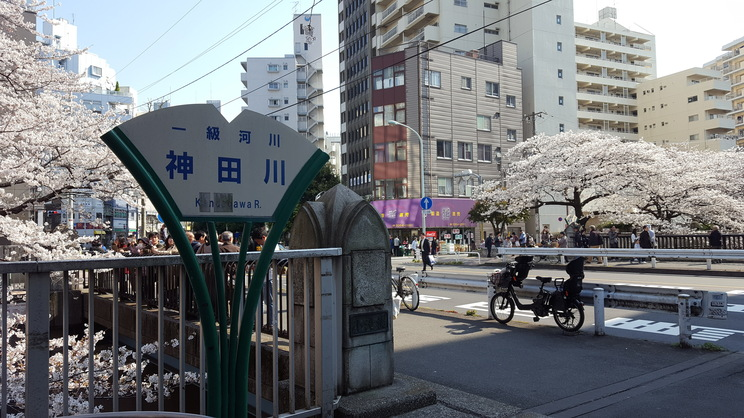
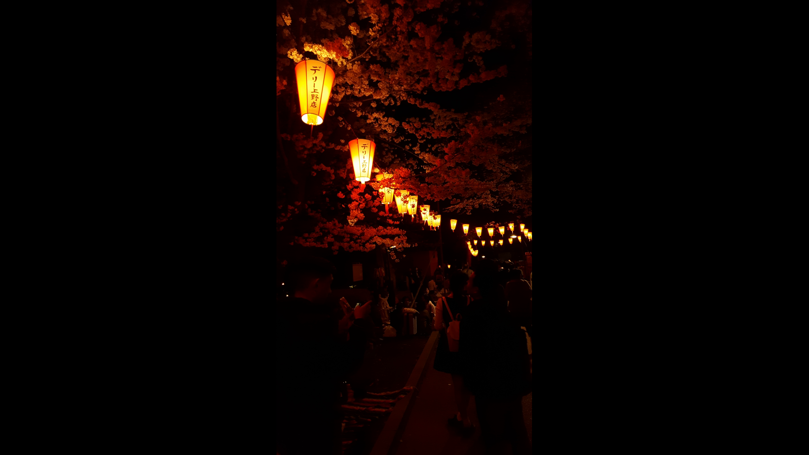
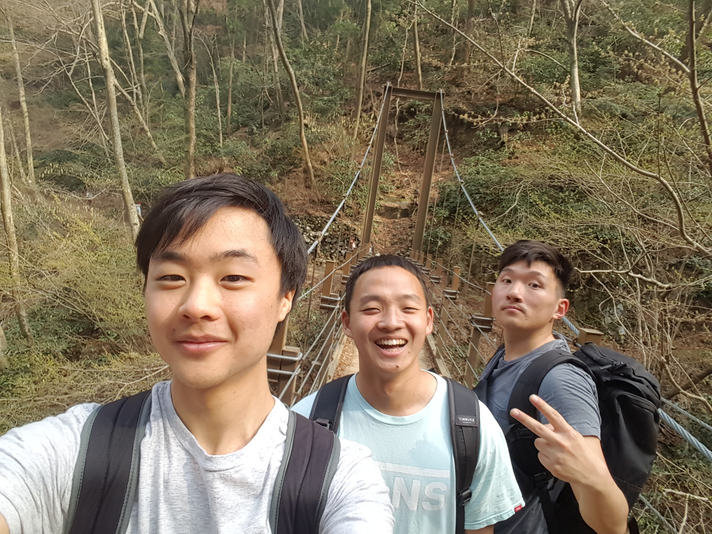
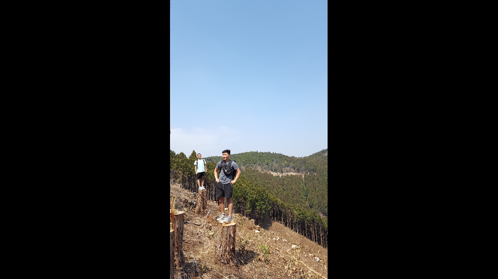
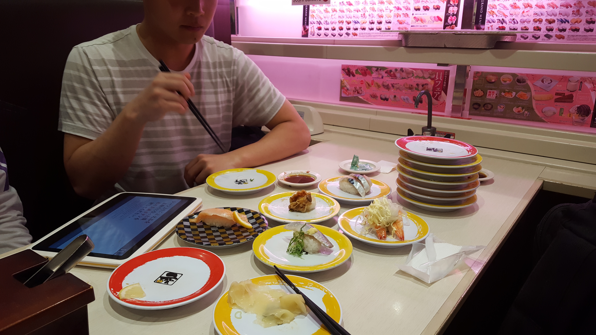

This is the start of a series where I will be recapping interesting or random photos I have taken in the past. Photos that elicit the same feelings I felt in the moment that I took them. Something I thought would be cool for future me to look back on.

The focus of this recap is my trip to Japan during the spring of my junior year at Northwestern (2018).

---

I visited Japan in March 2018 with two roommates. This is a good picture to start with. It is a photo I took while walking through the streets of Tokyo and shows some of the cherry blossoms Japan is known for. I highly recommend anyone wishing to visit Japan in the future to visit during this blooming season. It is beautiful and makes every journey outside, even a casual walk to the nearby 7 - 11, worthwhile. Props to Japan for integrating nature into the city landscape so elegantly. Something I wished I could see more of in the US.

---

I remember taking this photo and really liking how it came out. Had to also get low with the plants to get the 'right' angle.

---

One of my favorite photos I took. The pink was so vivid and pleasant that day as I walked by, under the natural lighting. I was glad to see this photo capture a bit of what I experienced.

---

A japanese cat absolutely chilling in the alleyways of the Tsukiji fish market. I had a few samples of sashimi while visiting here and concluded that if I were a cat, this place would be cat paradise.

---

There was a lantern festival going on in a park that we checked out. Some good things I recall from it: the warm late summer air, the allure of the red light lanterns at night, the fellowship of people having picnics around the park, and the food stands bustling with orders for grilled seafood.

---

Goons. From left to right: me, junwon, and barnabas.

---

View from one of the cleared slopes of Mt. Takao. This impromptu hike turned out to be one of the highlights of the trip. There was also little soba noodle shop along the trail that we stopped by. I remember ordering a single serving for us to share and asking for two more pairs of chopsticks. The shopkeeper did not oblige and I am not entirely sure why, but I'm guessing its one of those unspoken rules in Japan. One prominent example is not eating while walking; a habit I abuse pretty frequently in the US. After making a 7 - 11 run...who doesn't want to snack on their ice cream while walking back? But I do agree...it can be quite unsightly and thus impolite. Passing the chopsticks around, we all took turns on the noodles.

After the hike, we went to an onsen (a hot spring/sauna) to decompress. There were strict signs at the entrance stating that if you had a tattoo, you were not allowed entry. And it turns out...my friend has a rather large tattoo on his upper back at the shoulder blade. I suggested and thought it be funny if he cut his shirt in half and wear a makeshift crop top going in. This did not happen as there would be some interesting pictures to share (he just tossed a towel over his shoulder the entire time to conceal it). The hot waters hit just the spot and made for a good ending to the day.

---

I really loved the grass at this park. All that dead grass. It made it comfortable to sit, roll, and lay down on without the hassle of worrying about bugs or general itchiness that fresh grass comes with. The ideal platform to practice cartwheels or handstands. Since then, I've become a fan of dead grass for what it's worth.

---

Cheap quality sushi that comes on demand via a conveyor belt? **GOAT'ed**.
